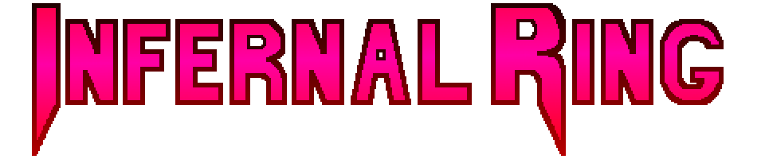

## TEAM RITUAL PRESENTS

### ❓ About
Infernal Ring is a classic 2D fighting game created in the Unity game engine with a familiar pixel art style, sporting an OST, original artwork, and a plethora of gameplay mechanics.

The game takes inspiration from such classic fighting games as Street Fighter, and newer fighting games such as Dragon Ball FighterZ, to make for a truly dynamic experience. The main mechanic of the game,
Rings, allows players to select among 9 unique playstyles at the beginning of a match, in addition to a color palette swap.

The game was undertaken by two sets of students under the same Senior Capstone team,
Team Ritual. In the spirit of competition with other members of our class, every team member poured countless hours, effort, and heart into the work presented into this project capping off our
college degrees (We hope it shows!). Thank you so much to the classmates and staff who made this game possible. Enter the Ring!

### Gameplay Features:
- An original soundtrack composed by dedicated members of the team.
- Multiple stages, drawn from scratch by our talented team.
- 2 fully fledged playable characters implemented using hierarchical state machines.
- Hand drawn and digitally drawn pixel art graphics for UI components, all character sprites, and all stage sprites.
- Multiple controller support.
- Cinematic super attacks.
- 9 different ways for characters to be played using the Ring system and multiple colors for both characters.
- Several different attacks with unique frame data, dealing different amounts of damage, hitstun, and blockstun.
- An attack priority mechanic with 5 different levels and clashing with attacks of the same priority.
- A combo system with damage scaling & proration based on the strength of different attacks.
- Combo extending mechanics such as ground and wall bounces, sliding and hard knockdowns, and double jump cancels.
- Meter burn mechanics including dash-cancels, airdash-cancels, EX special moves, and more.
- ...And much more!
